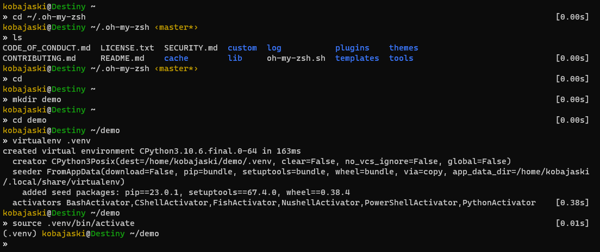
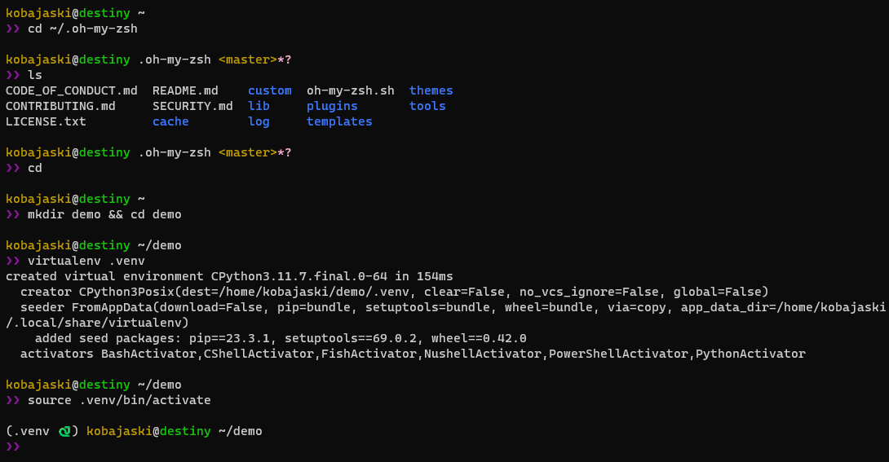

- [gallifrey-war](#gallifrey-war)
  - [**__Oh-My-Zsh__**](#oh-my-zsh)
    - [Demo](#demo)
    - [Installation](#installation)
  - [**__Starship__**](#starship)
    - [Demo](#demo-1)
    - [Installation](#installation-1)

# gallifrey-war

[Oh-My-Zsh](https://ohmyz.sh/) and [Starship](https://starship.rs/) theme inspired by
[`gallifrey` theme](https://github.com/ohmyzsh/ohmyzsh/wiki/Themes#gallifrey)

## **__Oh-My-Zsh__**



### Demo


### Installation

Copy `zsh-theme` file in your [Oh-My-Zsh](https://ohmyz.sh/) theme folder

```sh
$ wget https://raw.githubusercontent.com/cdubos-fr/gallifrey-war/main/gallifrey-war.zsh-theme \
    -O ~/.oh-my-zsh/themes/gallifrey-war.zsh-theme
```

then, update your `.zshrc` config file:
```sh
$ vim ~/.zshrc
```
change `ZSH_THEME` variable:
```sh
ZSH_THEME="gallifrey-war"`
```

Tested on:
- `Ubuntu-20.04`
- `Ubuntu-22.04`
- `WSL 2`

## **__Starship__**



### Demo


### Installation

Copy `toml` configuration file in your `.config` folder

```sh
$ wget https://raw.githubusercontent.com/cdubos-fr/gallifrey-war/main/gallifrey-war.toml \
    -O ~/.config/starship.toml
```

Tested on:
- `Ubuntu-20.04`
- `Ubuntu-22.04`
- `WSL 2`
- `MacOS Sonoma`
