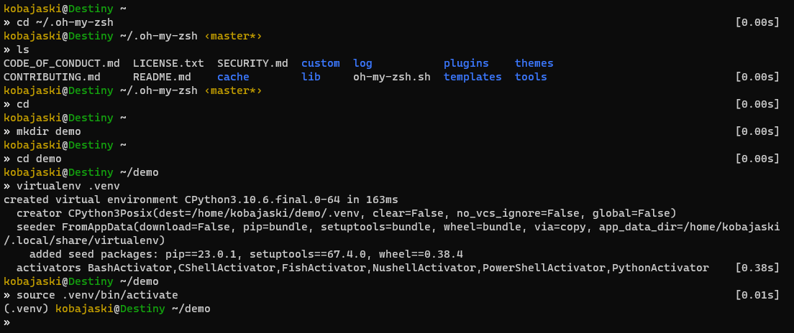

# gallifrey-war

[Oh-My-Zsh](https://ohmyz.sh/) theme inspired by `gallifrey` legacy theme



## Demo


## Installation

Copy `zsh-theme` file in your [Oh-My-Zsh](https://ohmyz.sh/) theme folder

```sh
$ wget https://raw.githubusercontent.com/cdubos-fr/gallifrey-war/main/gallifrey-war.zsh-theme \
    -O ~/.oh-my-zsh/themes/gallifrey-war.zsh-theme
```

then, update your `.zshrc` config file:
```sh
$ vim ~/.zshrc
```
change `ZSH_THEME` variable:
```sh
ZSH_THEME="gallifrey-war"`
```

Tested on:
- `Ubuntu-20.04`
- `Ubuntu-22.04`
- `WSL 2`
